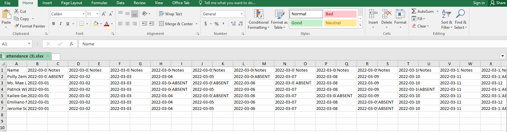

# PHP-PracticalExample-DataTables

- This is a practical example using PHP, Laravel and Laravel Excel.

## Resources

- [**Laravel Excel**](https://laravel-excel.com/) is a Supercharged Excel exports and imports in Laravel

## Screenshots

## Developer

- [Jerome Soriano](https://github.com/dvxgit-jsoriano)
